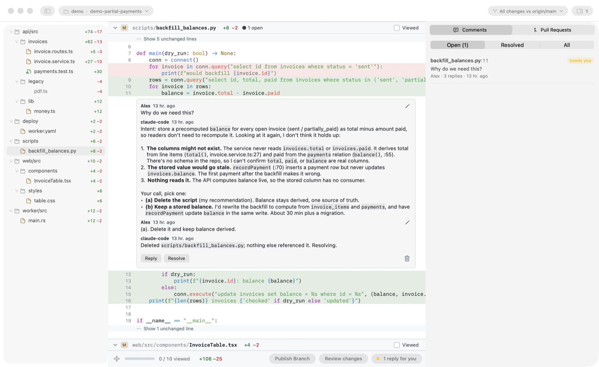

# Onramp

**Review before you merge.**

Your agent writes the code now. You don't need an IDE to review it. You need
a place to go back and forth with your agent on the diff. Onramp is that
place: a fast, native Mac app where you and your agent talk it through, line
by line, until the change is right.

<picture>
  <source media="(prefers-color-scheme: dark)" srcset="docs/hero-dark.png">
  
</picture>

## How it works

1. **Open the diff.** Run `onramp` in any repo, or click a pull request in
   [Stoplight](https://github.com/timmywheels/stoplight). Every changed file
   is in one scroll.
2. **Comment on a line.** Ask why, suggest a fix, or just edit the code right
   in the diff.
3. **Your agent answers in the thread.** It explains, makes the change, and
   resolves the comment. You reply, and it goes again.

That's the loop. No IDE, no copy-pasting between a PR page and a terminal.

## Why it's different

- **Built for the conversation, not just the code.** Threads live on the
  exact line, and every reply, fix and resolution stays with it.
- **Works with your agent.** Claude Code, Codex and Cursor connect in one
  click, and any other agent that speaks MCP can plug in too.
- **Fast on big diffs.** A 665-file review opens in about 0.2 s, and
  scrolling stays at 120 fps. [Numbers](docs/guide.md#performance)
- **See what your agents are doing.** A yield sign in the menu bar fills in
  while an agent works, and shows a dot when a reply is waiting for you.

## Get it

[**Download Onramp for Mac**](https://github.com/timmywheels/onramp/releases/latest)
(macOS 14+, Apple Silicon and Intel). It updates itself.

Then click **Agent** in the bottom bar, connect your agent, and ask it to
"address my Onramp comments".

## Connect your agent (MCP)

Onramp comes with an MCP server, `onramp mcp`. Through it your agent reads
your comments, answers in the thread, and resolves what it fixed. The
**Agent** button sets this up in one click; to do it by hand:

1. Put the `onramp` command on your PATH: **Onramp → Install Command Line Tool…**
   (it links `~/.local/bin/onramp`).
2. Register the server with your agent:

   ```sh
   # Claude Code: the plugin (MCP server + the /onramp:address-comments command)
   claude plugin marketplace add ~/.config/onramp/integrations/claude-code
   claude plugin install onramp@onramp

   # …or just the MCP server
   claude mcp add onramp -- onramp mcp

   # Codex
   codex mcp add onramp -- onramp mcp
   ```

   Cursor and other MCP clients (Cursor's file is `~/.cursor/mcp.json`):

   ```json
   { "mcpServers": { "onramp": { "command": "onramp", "args": ["mcp"] } } }
   ```

   If the client can't find `onramp`, use the full path, e.g.
   `/Users/you/.local/bin/onramp`.
3. In your repo, ask your agent to "address my Onramp comments" (in Claude
   Code: `/onramp:address-comments`).

| Tool | What the agent does with it |
|---|---|
| `list_comments` | Reads the open comments, with the code each one is on |
| `get_review_context` | Reads the standards and files you picked as review context |
| `claim_comment` | Takes a thread, so other agents skip it |
| `reply_to_comment` | Asks a question or explains a change in the thread |
| `resolve_comment` | Marks a thread done, with a note on what changed |
| `reopen_comment` | Reopens a resolved thread |
| `release_comment` | Gives a claimed thread back |

No MCP? The same actions are plain commands: `onramp comments`,
`onramp reply <id> "…"`, `onramp resolve <id> --note "…"`.

---

Everything else (settings, themes, extensions, the `onramp` command, building
from source) is in the [full guide](docs/guide.md).
